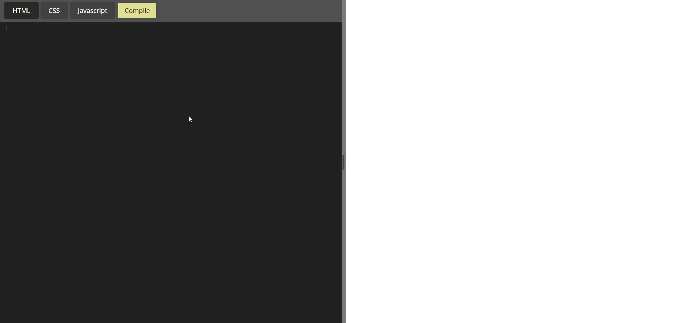
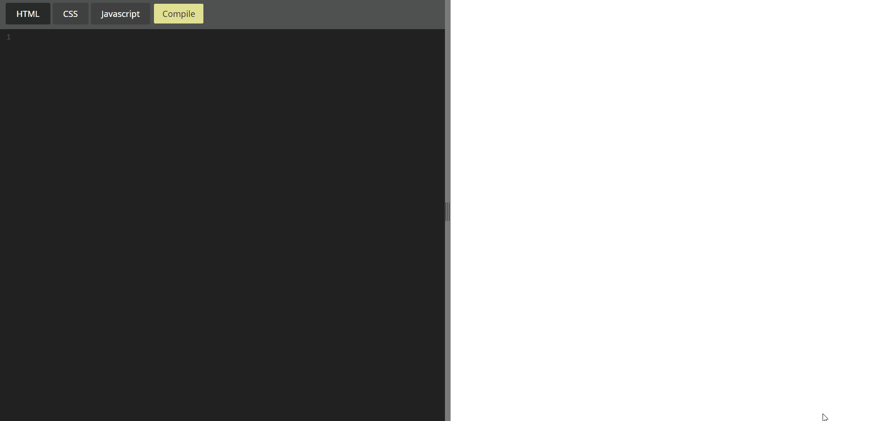
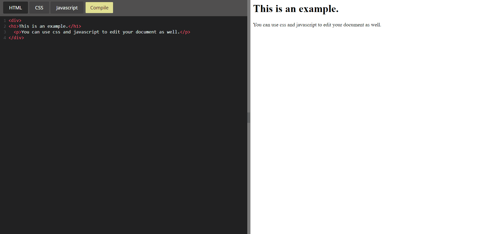
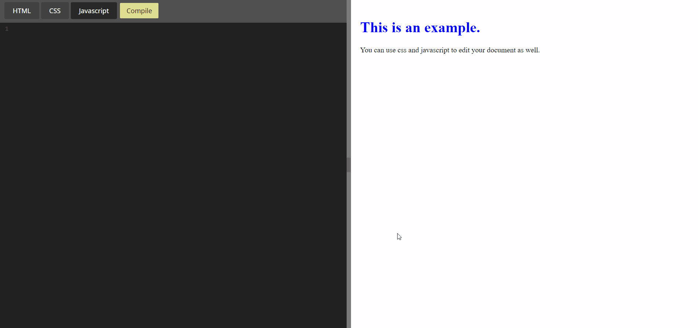

# [web-editor](http://webeditor.pythonanywhere.com/)
This is an editor that lets you create beautiful webpages using HTML, CSS, and Javascript right in your browser. It features a clean, material look, MathJax functionality, and resizable panes. Built with Flask. See the live demo [here](http://webeditor.pythonanywhere.com/).

## MathJax functionality:
MathJax is the easiest way to render beautiful math eqautions and symbols almost instantly. This editor lets you use normal MathJax commands and renders mathematics immediately. Core MathJax implementation and javascript courtesy of https://github.com/mathjax/MathJax/issues/2079. 

## HTML editing for the base.
Write all the HTML code you want without having an annoying, automatically refreshing output. Auto closing tags and error linting make for a hassle-free expereience. Hit Compile whenever you want to instantly render your HTML code.

## CSS styling for the eyes.
Don't like the ugly default HTML look? No worries, you can style any part of your webpage using CSS, featuring auto closing tags, error linting, and autocompletion hints.

## Javascript for the brains.
Add functionality to your document with Javascript and make it pop. Ajax support coming soon.

### Current Features:
* Auto closing tags and brackets
* Error linting when using CSS properties that don't exist and when HTML tags are not closed properly
* Search and find (Ctrl-F)
* Autocompletion (Ctrl-Space)
* Resizable panes, core javascript credit to https://stackoverflow.com/questions/12194469/best-way-to-do-a-split-pane-in-html. 
* Built-in MathJax support

### Upcoming Features:
* Built-in AJAX support 
* Ability to comment code
* Save your code to your desktop or the cloud
* More coming soon...
